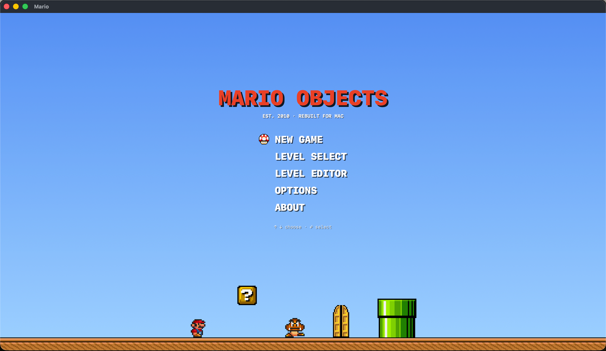
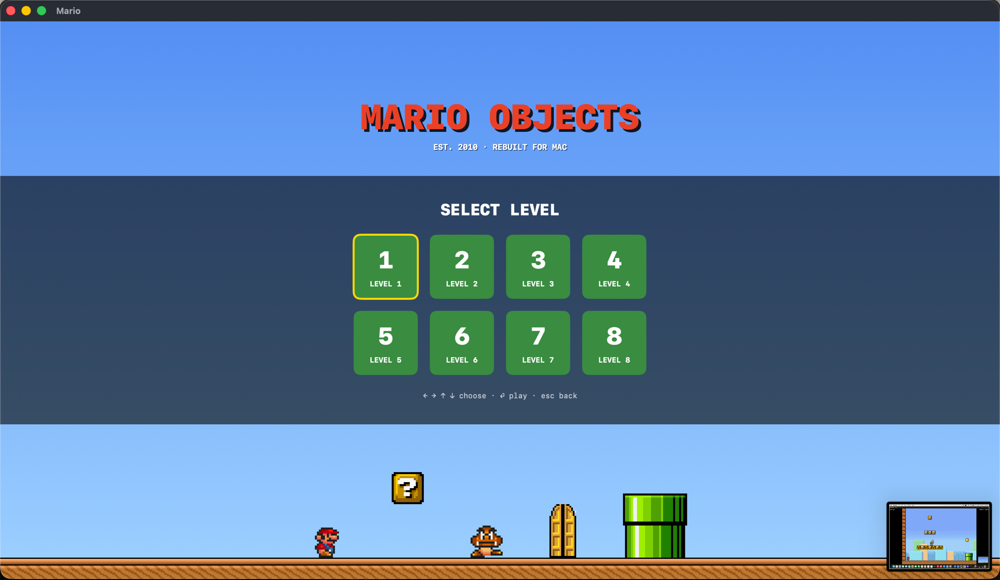
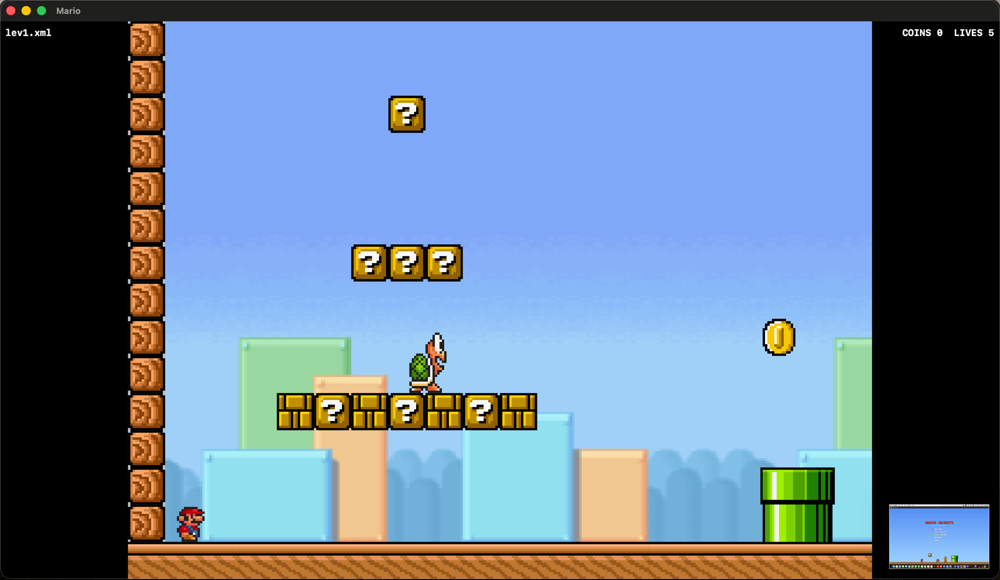
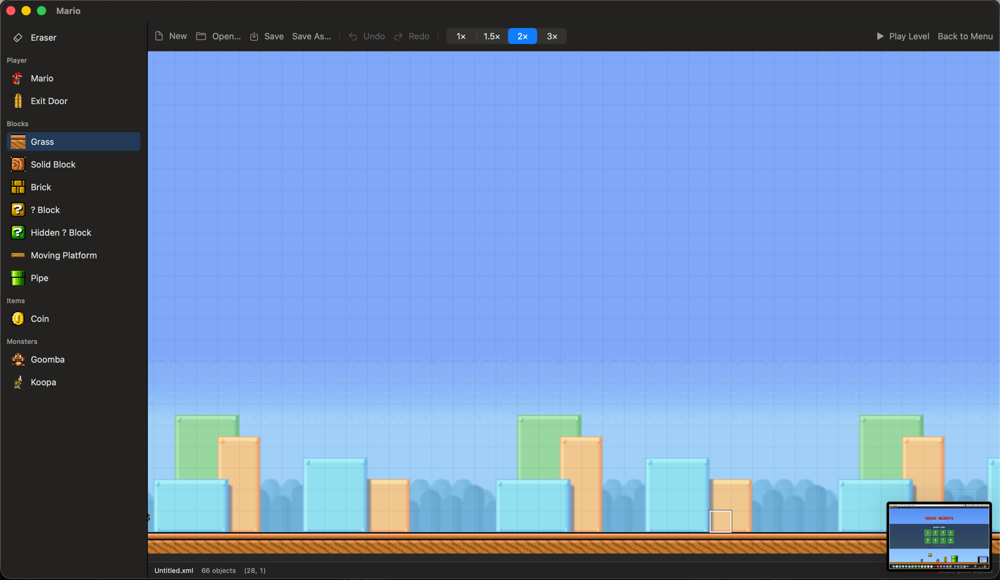
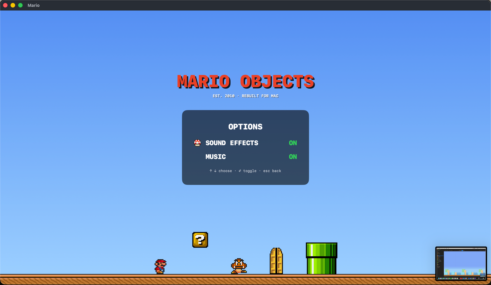
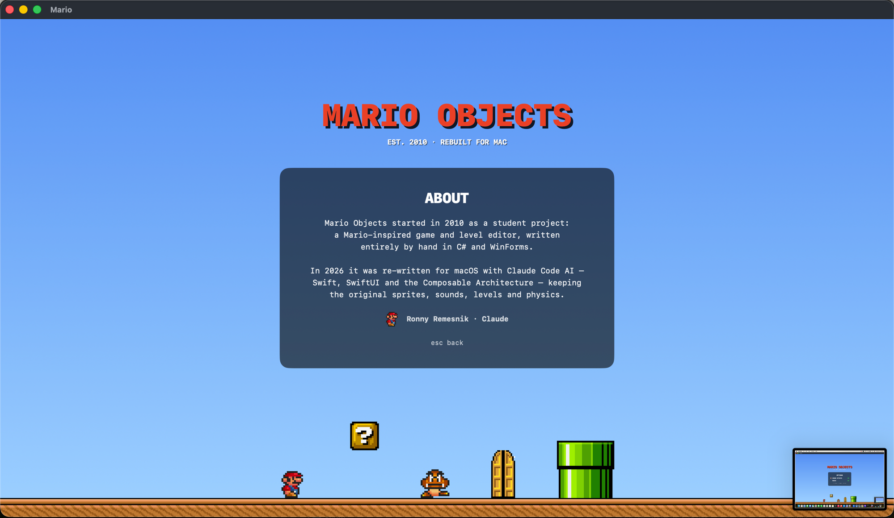

# MarioSwift

Native macOS rewrite of the 2010 C# "Mario Objects" game + level editor:
Swift 6, SwiftUI, and the Composable Architecture. The simulation in
`MarioKit` is a faithful port of the original engine (same physics constants,
same collision behavior — minus the old wall-climb bug, fixed on purpose)
and loads the original level XML files.

## Features

- **Engine (`MarioKit`)** — deterministic 20Hz simulation, ported object-for-object
  from the C# original (physics constants, collision, enemy/item behavior),
  plus a legacy-compatible level XML codec. The one deliberate behavior change:
  the old wall-climb bug is fixed via axis-separated collision resolution.
- **Playable app** — title screen, level select with progress locks (persisted
  via `@Shared(.appStorage)`), 8 levels (3 original + 5 new with a difficulty
  ramp), classic death sequence (leap animation, synthesized jingle, "MARIO × N"
  lives interstitial), sound/music options, about screen.
- **Level editor** — ported as a TCA feature: palette + drag-paint, undo/redo,
  params inspector, ⌃-click eyedropper, open/save round-trips the legacy XML
  format, "Play Level" jumps straight into the game and back. Reachable from
  the title screen (LEVEL EDITOR, ⌘E) or the in-game menu.
- **Renderer** — SwiftUI Canvas with engine-side culling and a bounded sprite
  cache (only on-screen objects are drawn/cached).
- **Tests** — 51 tests across 11 suites: engine + codec unit tests, TCA
  reducer tests via `TestStore` (game flow, editor, navigation, exhaustive
  where it matters), and a geometry runner-bot that proves every shipped
  level is completable.

See [`REWRITE_PLAN.md`](../REWRITE_PLAN.md) at the repo root for the phased
build log.

## Screenshots

| Title screen | Level select | Gameplay |
|---|---|---|
|  |  |  |

| Level editor | Options | About |
|---|---|---|
|  |  |  |

## Run

```sh
cd MarioSwift
swift run MarioApp
```

Controls: ← → move · ↑ or Z jump · space or X fireball · ⏎ enter the exit door ·
P pause · R restart level · esc back to menu. From the title screen, choose
LEVEL EDITOR (⌘E) to design levels; the editor's "Play Level" runs them
immediately in-game and can hand you back to the editor afterward.

## Test

```sh
Scripts/test.sh        # NOT bare `swift test` — see note
```

This machine setup (Command Line Tools without Xcode) needs explicit
Testing.framework search paths; the script adds them.

## Debug rendering headlessly

```sh
swift run MarioApp --screenshot /tmp/frame.png 40             # lev1 after 40 ticks
swift run MarioApp --screenshot /tmp/f.png 100 Level5.xml     # any bundled level
swift run MarioApp --menu-screenshot /tmp/m.png levels        # main|levels|options|about
swift run MarioApp --editor-screenshot /tmp/e.png
```

## Levels

`Scripts/make_levels.py` regenerates the five 2026 levels (Level4–Level8)
from code; the design rules that keep them beatable are documented in the
script. The geometry of every level is proven completable by a runner bot
in `LevelGeometryTests`.

## Layout

- `Sources/MarioKit` — pure model + engine: level XML codec, deterministic
  20Hz `GameWorld` simulation, no UI. See `REWRITE_PLAN.md` at the repo root.
- `Sources/MarioApp` — TCA features (`AppFeature`, `GameFeature`) + SwiftUI
  views (Canvas renderer, keyboard via NSEvent monitors) + AVFoundation audio.
- `Tests/MarioKitTests` — codec + engine behavior tests.
